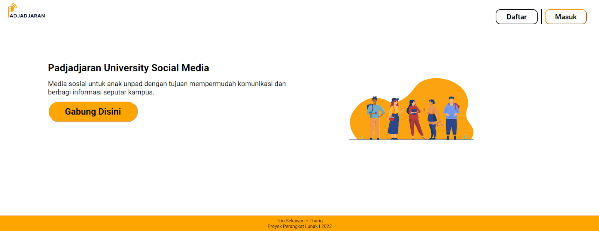
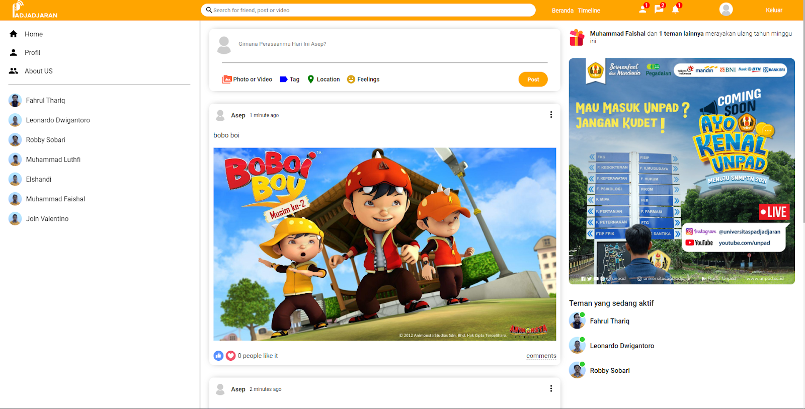

# PadjadjaranHub

PadjadjaranHub adalah aplikasi sosial media berbasis web yang mempermudah mahasiswa Universitas Padjadjaran untuk saling berkomunikasi. Aplikasi ini memiliki beberapa fitur seperti mengikuti dan berhenti mengikuti user lainnya, memperbaiki status pribadi, menyukai dan tidak menyukai postingan.

 

## User Guides

* klik link https://padjadjaran-hub.herokuapp.com/ 
* Masuk ke menu register untuk mendaftar. Masukan nama, email, password dan konfirmasi password. 
    - Terdapat beberapa syarat untuk mendaftar yakni username tidak boleh sama dengan user lainnya, email harusciri dari alamat email yakni @, password harus minimal 6 digit dan dikonfirmasi ulang.
* Setelah berhasil mendaftar user dapat langsung masuk ke aplikasi melalui halaman login, masukan email dan password yang telah didaftarkan.
* Dihalaman utama aplikasi, user dapat melihat konten dari aplikasi, untuk pengguna awal halaman konten akan kosong.
* Lakukan pilihan untuk mengikuti pengguna lain dengan mengklik https://padjadjaran-hub.herokuapp.com/profile/Leonardo%20Dwigantoro kemudian tekan tombol follow.
* Lalu kembali ke halaman utama dan postingan user yang telah diikuti akan terlihat.
* User juga dapat melakukan posting baik itu foto maupun pesan text.
* User dapat menyukai dan tidak menyukai postingan sendiri dan orang lain.
* User dapat meng-unfollow user lain yang telah di follow.
* Setelah menggunakan PadjadjaranHub user dapat logout dan kembali ke menu halaman utama.

## Classes Used

